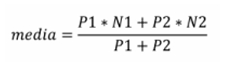

# Lista de Exercícios 01   Estruturas e Comandos Condicionais

##### **Este arquivo contém apenas os enunciados dos exercícios. Para ver as propostas de solução, acesse: [resolucoes.md](resolucoes.md)**

---

1 - Ler um valor e escrever a mensagem “É MAIOR QUE 10!” se o valor lido for maior 
que 10, caso contrário escrever “NÃO É MAIOR QUE 10!”.   

2 - Ler um valor real qualquer e escrever se o mesmo é (estritamente) “Positivo”, 
“Negativo” ou igual a “Zero”.  

3 - Ler as notas da 1a. e 2a. avaliações de um aluno. Calcular a média aritmética simples 
e escrever uma mensagem que diga se o aluno foi ou não aprovado (considerar que nota 
igual ou maior que 7 o aluno é aprovado). Escrever também a média calculada.

4 - Escreva um programa que receba/leia um número inteiro do usuário e informe se esse 
número é “Par” ou “Ímpar”.

5 - Fazer um programa que lê um valor real, um operador aritmético (+,-,*,/) e outro 
valor real e imprime o resultado da expressão, de acordo com a seguinte entrada:  
“<valor 1> <operador> <valor 2>” 
e produza a seguinte saída: “= <resultado>” (sem as aspas) onde <resultado> informa o 
resultado da expressão aritmética dada como entrada. 

6 - Escreva um programa que verifique a validade de uma senha fornecida pelo usuário. 
A senha válida é “abacate”. Devem ser impressas as seguintes mensagens: 
“ACESSO PERMITIDO”, caso a senha seja válida.  
“ACESSO NEGADO”, caso a senha seja inválida.

7 - Faça um programa para ler dois números inteiros A e B e informar se “A é divisível 
por B”.

8 - Faça um programa para ler um salário e atualizá-lo (imprimindo na tela o novo valor) 
de acordo com a tabela abaixo, utilizando o comando “switch”: 
| Faixa salarial            | Aumento   |
| :---:                     | :---:     |
| até 600,00                | 30%       |
| 600,01 a     1.100,00  | 25%       |
| 1.100,01 a   2.400,00  | 20%       |
| 2.400,01 a   3.550,00  | 15%       |
| Acima de     3.550,00  | 10%       |

9 - Dados três tamanhos de segmentos de reta a, b e c, se a+b>c e a+c>b e b+c>a, estes 
segmentos de reta podem formar um triângulo. Faça um programa que, dados os valores 
dos tamanhos dos segmentos de reta a, b e c, verificar / informar se formam (podem 
formar) ou não um triângulo. Além disso, se forma um triângulo, classifique o triângulo 
como: “Equilátero”, “Isósceles” ou “Escaleno”. 

10 – Escreva um programa que calcule a média de cada aluno de uma disciplina, 
seguindo a seguinte fórmula:  
  
ou média = (P1 ∗ N1 + P2 ∗ N2) / (P1 + P2)  
Em que o programa deve ler os valores reais N1 e N2 (que são as notas de cada 
aluno da disciplina) e P1 e P2 (que são os respectivos pesos destas notas). Informe a 
média e se o aluno foi “Aprovado” (média maior ou igual a 7,0), ficou de “Final” 
(média menor que 7,0 e maior ou igual a 4,0) ou se ficou “Reprovado” (média menor 
do que 4,0).  

---

##### **Este arquivo contém apenas os enunciados dos exercícios. Para ver as propostas de solução, acesse: [resolucoes.md](resolucoes.md)**