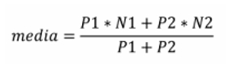

# Lista de Exercícios 01 - Resoluções

1 - Ler um valor e escrever a mensagem “É MAIOR QUE 10!” se o valor lido for maior 
que 10, caso contrário escrever “NÃO É MAIOR QUE 10!”.   
```c
#include <stdio.h>

int main() {
    float valor;
	
    printf("Insira um numero:");
    scanf("%f", &valor);
	
    if(valor > 10.0) printf("E MAIOR QUE 10!");
    else printf("NAO E MAIOR QUE 10!");	
    return 0;
}
```
Código fonte: [codigos-fonte/exercicio-01.c](codigos-fonte/exercicio-01.c)

2 - Ler um valor real qualquer e escrever se o mesmo é (estritamente) “Positivo”, 
“Negativo” ou igual a “Zero”.  
```c
#include <stdio.h>

int main() {
    float valor = 0.0;
	
    printf("Insira um numero: ");
    scanf("%f", &valor);
	
    if(valor > 0.0) printf("Positivo");
    else if(valor < 0.0) printf("Negativo");
    else printf("Zero");
    return 0;
}
```
Código fonte: [codigos-fonte/exercicio-02.c](codigos-fonte/exercicio-02.c)

3 - Ler as notas da 1a. e 2a. avaliações de um aluno. Calcular a média aritmética simples 
e escrever uma mensagem que diga se o aluno foi ou não aprovado (considerar que nota 
igual ou maior que 7 o aluno é aprovado). Escrever também a média calculada.
```c
#include <stdio.h>

int main() {
    float n1, n2, media;
	
    printf("Insira a nota da avaliacao 1a: ");
    scanf("%f", &n1);
    printf("Insira a nota da avaliacao 2a: ");
    scanf("%f", &n2);
	
    media = (n1 + n2) / 2.0;
	
    if(media >= 7.0) printf("Aluno aprovado!\nMedia: %.1f", media);
    else printf("Aluno reprovado!\nMedia: %.1f", media);
    return 0;
}
```
Código fonte: [codigos-fonte/exercicio-03.c](codigos-fonte/exercicio-03.c)

4 - Escreva um programa que receba/leia um número inteiro do usuário e informe se esse 
número é “Par” ou “Ímpar”.
```c
#include <stdio.h>

int main() {
    int numero;

    printf("Informe um número inteiro: ");
    scanf("%d", &numero);

    if(numero % 2 == 0) printf("O número é par!");
    else printf("O número é ímpar!");
    return 0;
}
```
Código fonte: [codigos-fonte/exercicio-04.c](codigos-fonte/exercicio-04.c)

5 - Fazer um programa que lê um valor real, um operador aritmético (+,-,*,/) e outro 
valor real e imprime o resultado da expressão, de acordo com a seguinte entrada:  
“`<valor 1> <operador> <valor 2>`” 
e produza a seguinte saída: “= `<resultado>`
” (sem as aspas) onde `<resultado>` informa o 
resultado da expressão aritmética dada como entrada.
```c
#include <stdio.h>

int main() {
    int valor1, valor2, resultado;
    char operador;
	
    printf("Informe um valor real, um operador aritmetico e outro valor real: ");
    scanf("%d %c %d", &valor1, &operador, &valor2);
	
    switch(operador) {
    case '+': 
    	resultado = valor1 + valor2;
    	break;
    case '-': 
    	resultado = valor1 - valor2;
    	break;
    case '*': 
    	resultado = valor1 * valor2;
    	break;
    case '/': 
    	resultado = valor1 / valor2;
    	break;
    default: 
    	printf("ERRO: O operador \"%c\" e invalido!", operador);
    	return 1;
    }
	
    printf("%d %c %d = %d", valor1, operador, valor2, resultado);
	return 0;
}
```
Código fonte: [codigos-fonte/exercicio-05.c](codigos-fonte/exercicio-05.c)

6 - Escreva um programa que verifique a validade de uma senha fornecida pelo usuário. 
A senha válida é “abacate”. Devem ser impressas as seguintes mensagens: 
“ACESSO PERMITIDO”, caso a senha seja válida.  
“ACESSO NEGADO”, caso a senha seja inválida.
```c
#include <stdio.h>
#include <string.h>

int main() {
    char senha[8] = "abacate";
    char senha_fornecida[8] = "";
	
    printf("Informe a senha: ");
    scanf("%s", senha_fornecida);
    
    if(strcasecmp(senha, senha_fornecida) == 0) printf("\nACESSO PERMITIDO");
    else printf("\nACESSO NEGADO");
    return 0;
}
```
Código fonte: [codigos-fonte/exercicio-06.c](codigos-fonte/exercicio-06.c)

7 - Faça um programa para ler dois números inteiros A e B e informar se “A é divisível 
por B”.
```c
#include <stdio.h>

int main() {
    int a, b;
	
    printf("Informe um numero inteiro: ");
    scanf("%d", &a);
    printf("Informe outro numero inteiro: ");
    scanf("%d", &b);
	
    if(a % b == 0) printf("%d e divisivel por %d", a, b);
    else printf("%d nao divisivel por %d", a, b);
    return 0;
}
```
Código fonte: [codigos-fonte/exercicio-07.c](codigos-fonte/exercicio-07.c)

8 - Faça um programa para ler um salário e atualizá-lo (imprimindo na tela o novo valor) 
de acordo com a tabela abaixo, utilizando comandos “if - else” aninhados:
| Faixa salarial            | Aumento   |
| :---:                     | :---:     |
| até 600,00                | 30%       |
| 600,01 a   <br> 1.100,00  | 25%       |
| 1.100,01 a <br> 2.400,00  | 20%       |
| 2.400,01 a <br> 3.550,00  | 15%       |
| Acima de   <br> 3.550,00  | 10%       |
```c
#include <stdio.h>

int main() {
    float salario;
    int aumento;
	
    printf("Informe o valor do salario: R$");
    scanf("%f", &salario);
	
    if(salario > 0.0 && salario <= 600.0) salario += salario * 0.3;
    else if(salario > 600.01 && salario <= 1100.0) salario += salario * 0.25;
    else if(salario > 1100.01 && salario <= 2400.0) salario += salario * 0.2;
    else if(salario > 2400.01 && salario <= 3550.0) salario += salario * 0.1;
    else if(salario > 3550.0) aumento = 10;
	
    printf("Valor do salario atualizado: R$%2.f", salario);
    return 0;
}
```
Código fonte: [codigos-fonte/exercicio-08.c](codigos-fonte/exercicio-08.c)

9 - Dados três tamanhos de segmentos de reta a, b e c, se a+b>c e a+c>b e b+c>a, estes 
segmentos de reta podem formar um triângulo. Faça um programa que, dados os valores 
dos tamanhos dos segmentos de reta a, b e c, verificar / informar se formam (podem 
formar) ou não um triângulo. Além disso, se forma um triângulo, classifique o triângulo 
como: “Equilátero”, “Isósceles” ou “Escaleno”. 
```c
#include <stdio.h>

int main() {
    int a, b, c;	
    printf("Informe o tamanho do segmente de reta a: ");
    scanf("%d", &a);
    printf("Informe o tamanho do segmente de reta b: ");
    scanf("%d", &b);
    printf("Informe o tamanho do segmente de reta c: ");
    scanf("%d", &c);
	
    if(a + b > c && a + c > b && b + c > a) {
     	if(a == b && b == c) printf("Triangulo equilatero");
    	else if(a == b && b != c) printf("Triangulo isosceles");
    	else printf("Triangulo escaleno");
    }
    return 0;
}
```
Código fonte: [codigos-fonte/exercicio-09.c](codigos-fonte/exercicio-09.c)
10 – Escreva um programa que calcule a média de cada aluno de uma disciplina, 
seguindo a seguinte fórmula:  
  
ou média = (P1 ∗ N1 + P2 ∗ N2) / (P1 + P2)  
Em que o programa deve ler os valores reais N1 e N2 (que são as notas de cada 
aluno da disciplina) e P1 e P2 (que são os respectivos pesos destas notas). Informe a 
média e se o aluno foi “Aprovado” (média maior ou igual a 7,0), ficou de “Final” 
(média menor que 7,0 e maior ou igual a 4,0) ou se ficou “Reprovado” (média menor 
do que 4,0).  
```c
#include <stdio.h>

int main() {
    float n1, n2, media;
    int p1 = 2, p2 = 3;
	
    printf("Informe a nota da N1: ");
    scanf("%f", &n1);
    printf("Informe a nota da N2: ");
    scanf("%f", &n2);
    
    media = (n1 * p1 + n2 * p2) / (p1 + p2);
    
    if(media >= 7.0) printf("Media: %2.f\nSituacao: Aprovado", media);
    else if(media >= 4.0 && media < 7.0) printf("Media: %2.f\nSituacao: Avaliacao final", media);
    else printf("Media: %2.f\nSituacao: Reprovado", media);
    return 0;
}
```
Código fonte: [codigos-fonte/exercicio-10.c](codigos-fonte/exercicio-10.c)